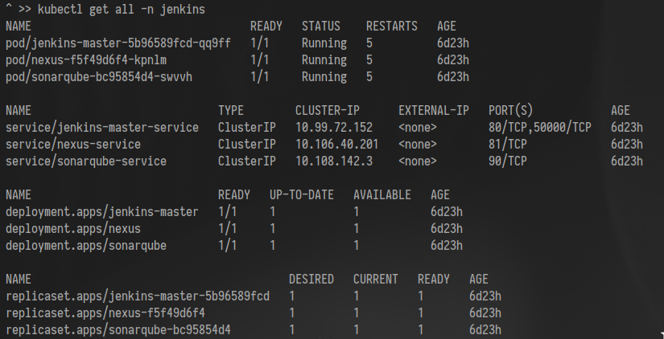
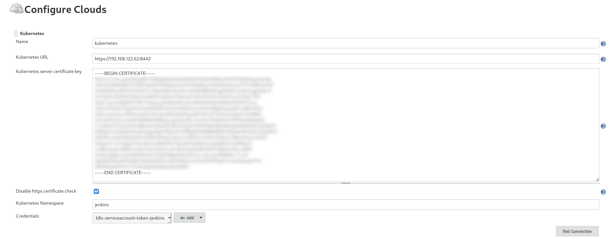
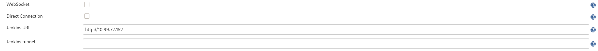
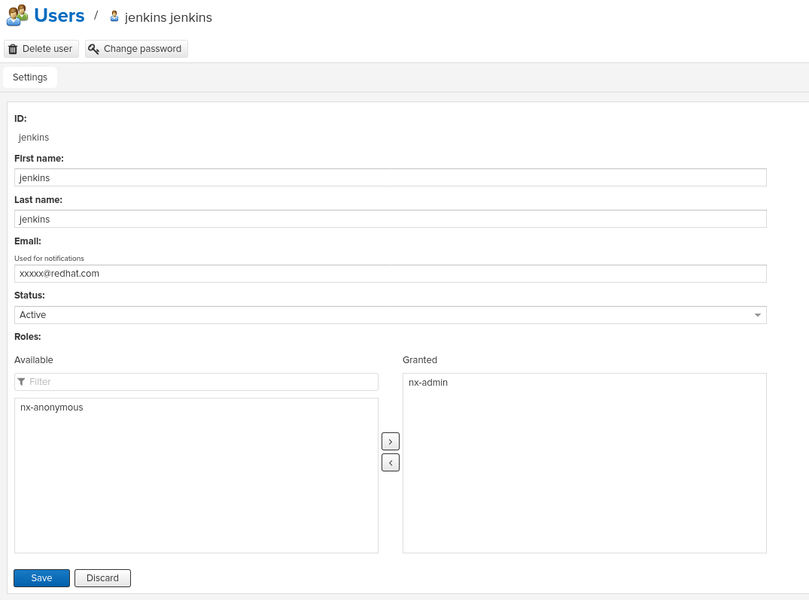
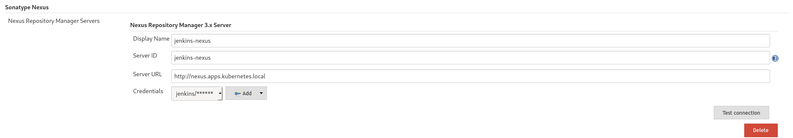
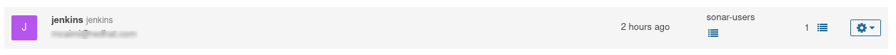
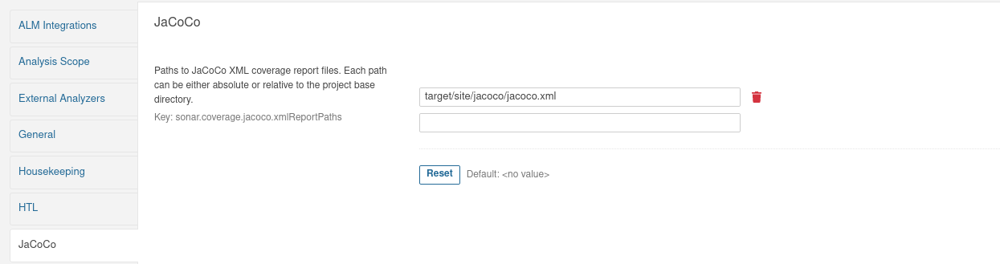
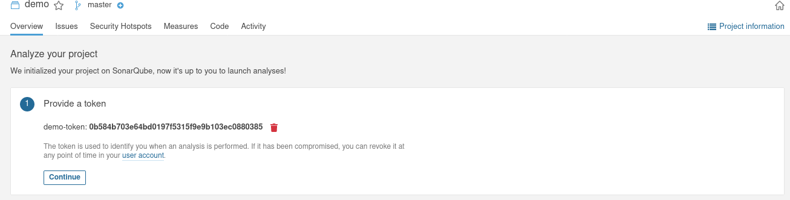
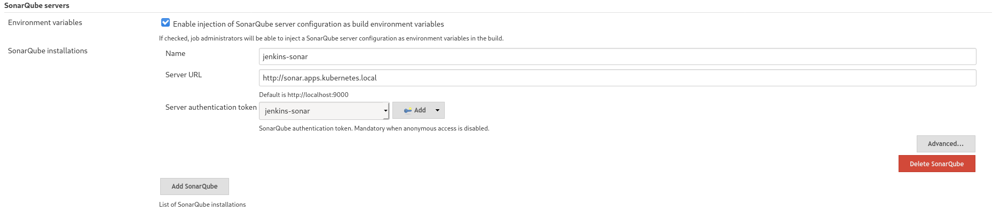
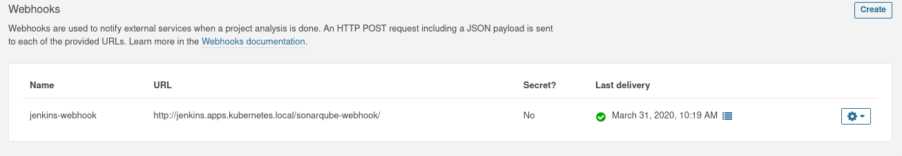

K8S CI/CD DEMO
==============

This is a work-in-progress demo of a CI/CD workflow based on Kubernetes and Jenkins. Look here for `openshift`_ native deployments.
This demo makes use of the following projects:

- Kubernetes/OpenShift as a container orchestrator
- Kustomize for templating
- Jenkins as a pipeline job runner
- SonarQube for code quality and coverage measurements
- Nexus for storing artifacts
- JUnit for unit testing
- JaCoCo for code coverage
- Quarkus as an application runtime
- Flyway as Database schema management
- PostgreSQL for the database backend
- Hadolint for Dockerfile linting

It is not a lightweight setup, as at least 4 vCPUs and 8GB of RAM are needed for the minikube vm.
Also, since this demo *is still WIP*, this documentation is far from being finished and is to be considered **INCOMPLETE** for the time being.

The workshop is aimed at learning a possible way to implement an e2e CI/CD pipeline with the mentioned technologies, and it is loosely divided in 6 'steps':

1) BUILD A CUSTOM K8S BUILD AGENT (Referencing pipeline **Jenkinsfile.agent-builder**)
2) BUILD THE SOFTWARE ARTIFACT (Referencing pipeline **Jenkinsfile.build-phase**)
3) BUILD THE RUNNABLE CONTAINER IMAGE (Referencing pipeline **Jenkinsfile.java-runner**)
4) DEPLOY A COMPANION DB (Referencing pipeline **Jenkinsfile.create-pdb**)
5) DEPLOY THE APPLICATION (Referencing pipeline **Jenkinsfile.app_deploy**, unfinished)
6) ORCHESTRATE THE FLOW (Referencing pipeline **Jenkinsfile.master**)

PREREQUISITES
-------------

1) Install Minikube from the official distribution (or from the official repos of your distro of choice) and provision a VM:

.. code:: bash

  minikube start --cpus=4 --memory=8GB --disk-size=20G --addons=registry,ingress

If you are planning to run everything locally (eg. no secure Ingresses in place), add the url of the registry as an `insecure`_ source:

.. code:: bash

  minikube start --cpus=4 --memory=8GB --disk-size=20G --addons=ingress,registry --insecure-registry registry.apps.kubernetes.local

Remember to add the url of the insecure registry to the registries.conf file on the host machine (/etc/containers/registries.conf)
to add registry url to insecure registries on the local host machine

2) Create the base namespaces that will be cosumed by the demo

.. code:: bash

  for i in jenkins dev preprod prod; do
    kubectl create ns $i
  done

These namespaces are used as follows:

- jenkins: this namespace is used to run builds, pipelines and to host CI/CD components such as Sonar and Nexus
- dev: the mock development environment
- preprod: the mock preproduction environment

Create the configmap insecure-registry-config from configmaps/components/docker-in-docker-insecure-registry-cm.yaml in the jenkins namespace

.. code:: bash

  kubectl apply -f configmaps/components/docker-in-docker-insecure-registry-cm.yaml -n jenkins

And finally edit and create the hadolint configuration configmap to fine-tune the Dockerfile linter:

.. code:: bash

  kubectl create cm hadolint-config-cm --from-file=hadolint.yaml=configmaps/components/hadolint.yaml -n jenkins

3) Add all needed urls to a local DNS resolver.

The demo uses the '*.apps.kubernetes.local' DNS domain. All the following names must resolve to the IP of the minikube VM or to the IP of the
ingress controller deployed in the environment:

- jenkins.apps.kubernetes.local
- sonar.apps.kubernetes.local
- registry.apps.kubernetes.local
- nexus.apps.kubernetes.local

If running in a local VM, setting them in /etc/hosts is sufficient.

4) Expose the registry with an Ingress Route:

.. code:: bash

  kubectl apply -f k8s/components/registry-ingress-kubernetes.yaml -n kube-system

Optionally, the ingress controller can also be installed and configured with `helm`_

DEMO SETUP
==========

ACCESS TO NAMESPACES
--------------------

Pipelines are run in the 'jenkins' namespace, and some pipelines will need to deploy manifests in other namespaces too.
A dedicated service account needs to be deployed on kubernetes in all the relevant namespaces (jenkins, dev, preprod).

.. code:: bash

  kubectl create sa ci-jenkins -n jenkins
  kubectl create sa ci-jenkins -n dev
  kubectl create sa ci-jenkins -n preprod
  kubectl create sa ci-jenkins -n prod

A custom role is also needed for the ci-jenkins service account to let the automation work. This role grants:

- Ability to monitor, deploy, undeploy manifests in the jenkins namespace
- Ability to monitor, deploy, undeploy manifests in the dev namespace
- Ability to monitor, deploy, undeploy manifests in the preprod namespace
- Ability to monitor, deploy, undeploy manifests in the prod namespace

A matching role binding also must be created in these namespaces:

#) Create jenkins role

.. code:: bash

  kubectl apply -f k8s/components/jenkins-role.yaml

#) Create jenkins rolebinding

.. code:: bash

  kubectl apply -f k8s/components/jenkins-rolebinding.yaml

DEPLOY COMPONENTS
-----------------

In the 'jenkins' namespace, deploy:

- The jenkins master server
- A SonarQube instance
- A Nexus Repository instance

Deploy the SonarQube PostgreSQL backend instance:

.. code:: bash

  $ kubectl apply -k k8s/deployments/pgsonar/ -n jenkins

Create the configmap used by sonar to connect to the database:

.. code:: bash

  $ kubectl create configmap sonar-properties --from-literal=username=sonarqube --from-literal=password=sonarpass --from-literal=connstring=jdbc:postgresql://sonarqubepostgres-service:5432/sonar_db?currentSchema=public -n jenkins

Deployment manifests are stored in the 'k8s/components' folder.

.. code:: bash

  for component in jenkins-master-deployment-kubernetes nexus-deployment-kubernetes sonarqube-deployment-kubernetes;
  do
    kubectl apply -f k8s/components/$component.yaml -n jenkins
  done

On minikube, if SonarQube does not get to run (i.e. pod remains in CrashLoopBack state):

.. code:: bash

  $ minikube ssh
  $ sysctl -w vm.max_map_count=262144

Once deployed, check that everything is running

Required Jenkins Plugins installed in the Master Node:

- Kubernetes plugin
- Kubernetes credentials
- Nexus Platform
- Nexus Artifact Uploader
- SonarQube Scanner
- JaCoCo plugin
- JUnit plugin
- Pipeline Utility Steps plugin
- (optional) BlueOcean

CONFIGURE JENKINS TO USE THE 'JENKINS' NAMESPACE FOR BUILDS
-----------------------------------------------------------

The Kubernetes plugin in jenkins needs to be configured in order to use the 'jenkins' namespace for builds.

1) Retrieve the Service Account login token from kubernetes (store the token in a Jenkins 'secret text' credentials object):

.. code:: bash

  kubectl get secret $(kubectl get sa ci-jenkins -n jenkins -o jsonpath={.secrets[0].name}) -n jenkins -o jsonpath={.data.token} | base64 --decode

2) Retrieve the API server CA certificate:

.. code:: bash

  kubectl get secret $(kubectl get sa ci-jenkins -n jenkins -o jsonpath={.secrets[0].name}) -n jenkins -o jsonpath={.data.'.ca\.crt'} | base64 --decode

3) Configure Jenkins to use the previous data to manage the 'jenkins' namespace:

4) get the jenkins service IP from kubernetes and add this to the plugin config

.. code:: bash

  kubectl get svc -n jenkins jenkins-master-service -o jsonpath='{.spec.clusterIP}'

CONFIGURE NEXUS
---------------

On the Nexus web console:

- Create a new 'jenkins' user on the Nexus Repository manager console and make it an admin of the 'maven-releases' repo
- Create a credentias object (type username with password) on Jenkins with the username and password of the newly created account

On the Jenkins web console:

- Configure a remote repository and point that to the local Nexus Instance

SONARQUBE CONFIG
----------------

1) On Sonar web console, create a 'jenkins' user

Required plugins:

- java and javascanner plugins
- git scm  plugins
- jacoco plugins 

2) Configure the plugin to search for jacoco report in the correct path (for reference, see pom.xml)

3) create a project on Sonar web console

- Get the project token and save it into Jenkins as a credentials object (type secret text)

4) Configure Jenkins to use the token in conjunction with SonarScanner

5) Create a webhook on the project page on Sonar Console to let Sonar push the Quality Gate measurements back to the Pipeline Job.

the web hook format is http[s]://<jenkins_url>/sonarqube-webhook/, with a '/' at the end.

TODO
====

#) Implement tests in the dev and preprod pipelines
#) Add support for Liquibase
#) Integrate Istio
#) Complete documenting the whole demo workflow

.. _insecure: https://minikube.sigs.k8s.io/docs/tasks/registry/
.. _openshift: https://github.com/mcaimi/k8s-demo-app/tree/master/openshift
.. _helm: https://github.com/mcaimi/k8s-demo-app/tree/master/k8s/ingress-nginx-helm
