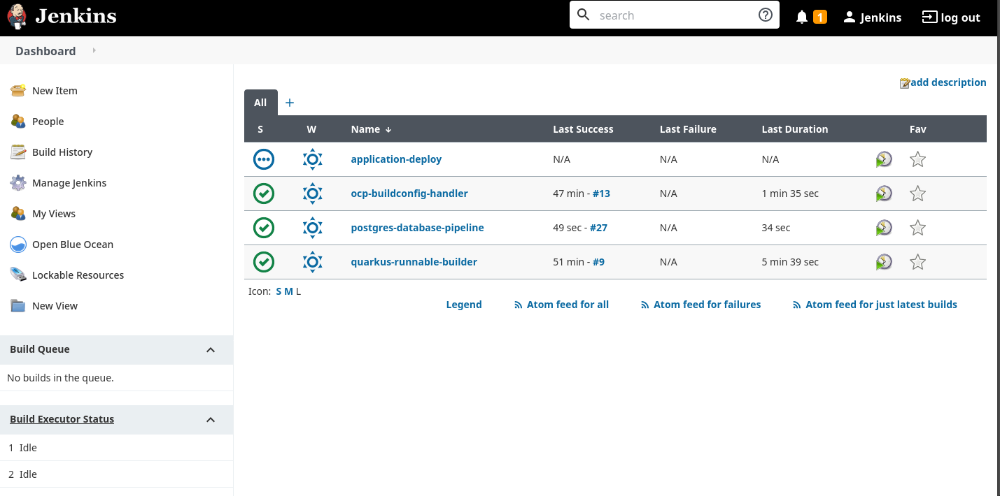

NOTES ABOUT OPENSHIFT
=====================

In OpenShift, some test containers (namely postgres) must be run with specific UIDs, therefore in this case the ci-jenkins service account
must be granted the 'anyuid' SCC:

.. code:: bash

  $ oc adm policy add-scc-to-user anyuid system:serviceaccount:jenkins:ci-jenkins

this must be done for every namespace in which jenkins needs to deploy.

Also depending on which Storage Class Backend employed, it may be necessary to set up an fsGroup securityContext override (or supplementalGroups for NFS).
The fastest way is just granting the anyuid SCC to the default service account as mentioned before but this is not good practice outside POC and demo environments.

For fsGroup in particular, a new SA can be created and granted the nonroot SCC:

.. code:: bash

  $ oc create sa nexus -n jenkins
  $ oc adm policy add-scc-to-user nonroot system:serviceaccount:jenkins:nexus

The nonroot SCC grants the RunAsAny fsGroup capability:

.. code:: bash

  $ oc get scc
  NAME                 PRIV      CAPS      SELINUX     RUNASUSER          FSGROUP     SUPGROUP    PRIORITY   READONLYROOTFS   VOLUMES
  [...]
  nonroot              false     []        MustRunAs   MustRunAsNonRoot   RunAsAny    RunAsAny    <none>     false            [configMap downwardAPI emptyDir persistentVolumeClaim projected secret]
  [...]

Then set up the deploymentconfig to run under the new service account to inherit the SCC:

.. code:: yaml

  ---
  apiVersion: apps/v1
  kind: Deployment
  metadata:
    name: nexus
    namespace: jenkins
  spec:
    replicas: 1
    selector:
      matchLabels:
        app: nexus
    template:
      metadata:
        labels:
          app: nexus
      spec:
        serviceAccount: nexus
        automountServiceAccountToken: true
        containers:
      [...]
      schedulerName: default-scheduler
      securityContext:
         fsGroup: 200
      [...]

for more information about SCCs, see official documentation here_

Setup Differences
-----------------

#) The Openshift setup uses an additional namespace ('prod'): this must be set up before creating roles and rolebindings.

.. code:: bash

  kubectl create sa ci-jenkins -n jenkins
  kubectl create sa ci-jenkins -n dev
  kubectl create sa ci-jenkins -n preprod
  kubectl create sa ci-jenkins -n prod

Roles and RoleBindings are found under the openshift/components folder:

#) Create jenkins role

.. code:: bash

  kubectl apply -f openshift/components/jenkins-role.yaml

#) Create jenkins rolebinding

.. code:: bash

  kubectl apply -f openshift/components/jenkins-rolebinding.yaml

Difference in Pipelines
-----------------------

Jenkins needs two additional plugins to manage OpenShift Clusters:

- Openshift Pipeline Plugin
- Openshift Client Plugin

Since Openshift offers the ability to run builds natively through the employment of BuildConfig objects, the Jenkins CI flow
differs slightly from the one that is run un K8S:

- **Jenkinsfile.agent-builder and Jenkinsfile.java-runner** have been replaced with **Jenkinsfile.buildconfig**: this pipeline runs and monitors buildconfig runs through the use of the Openshift Pipeline Plugin in Jenkins
- **Jenkinsfile.build-phase** now runs the image generation stage at the end of the pipeline (instead of leveraging another phase and another pipeline)
- **Jenkinsfile.dev_deploy** handles testing rollouts in dev environment via the Openshift Client Plugin for Jenkins
- **Jenkinsfile.end_to_end_deploy** simulates promotion between environments with final approval for production rollout.

The 'oc' binary has been added to the base maven-agent image.

In the 'prod' namespace, deployment configs and other object are **persistent**, so the first deploy needs to be manually performed:

.. code:: bash

  $ oc apply -k deployments/pgprod/
  $ oc apply -k deployments/prod/

The rollout afterwards will be handled by the last stage of the **Jenkinsfile.end_to_end_deploy** pipeline.

Custom Templating
-----------------

Templating is handled with **kustomize**. While it does not support custom CRs such as Openshift Routes and DeploymentConfigs, it can be patched by adding Custom Resources Definitions (CRDs) to the templates and by writing custom transformer rules.
This branch is mostly free of custom CRs in order to be fully compatible with vanilla k8s, but in any case instructions on how to extend
kustomize are reported here.

Look in the 'crds' folder in deployments/common and deployments/pgcommon.

For example, to let Kustomize correctly patch the VolumeClaimName in the deploymentconfig:

#) describe all needed fields in the DeploymentConfig CRD:

.. code:: json

	"github.com/mcaimi/k8s-demo-app/v1.DeploymentConfigSpec": {
		"Schema": {
			"properties": {
				"template": {
					"x-kubernetes-object-ref-api-version": "v1",
					"x-kubernetes-object-ref-kind": "PodTemplateSpec"
				},
 		        "template/spec/volumes/secret": {
					"x-kubernetes-object-ref-api-version": "v1",
					"x-kubernetes-object-ref-kind": "Secret"
				},
				"template/spec/containers/env/valueFrom/secretKeyRef": {
					"x-kubernetes-object-ref-api-version": "v1",
					"x-kubernetes-object-ref-kind": "Secret"
				},
				"template/spec/volumes/configMap": {
					"x-kubernetes-object-ref-api-version": "v1",
					"x-kubernetes-object-ref-kind": "ConfigMap"
				},
				"template/spec/volumes/persistentVolumeClaim": {
					"x-kubernetes-object-ref-api-version": "v1",
					"x-kubernetes-object-ref-kind": "PersistentVolumeClaim",
					"x-kubernetes-object-ref-name-key": "claimName"
				},
				"template/spec/containers/resources": {
					"x-kubernetes-object-ref-api-version": "v1",
					"x-kubernetes-object-ref-kind": "ResourceRequirements"
				}
			}
		}
	}

#) Instruct Kustomize to patch the 'claimName' field defined above with an ad-hoc nameReference transformer:

.. code:: yaml

  nameReference:
  - kind: PersistentVolumeClaim
  fieldSpec:
  - path: spec/template/spec/volumes/persistentVolumeClaim/claimName
    kind: DeploymentConfig

With CRDs baked in into kustomization templates, the 'patchesStrategicMerge' directive in kustomization.yaml will not work correctly. The workaround is to define a static patch:

.. code:: yaml

  - op: add
  path: "/spec/template/spec/containers/0/resources"
  value:
    limits:
      cpu: "1"
      memory: "2Gi"
    requests:
      memory: "500Mi"
      cpu: "500m"
  
and use the 'patchesJson6902' strategy:

.. code:: yaml

  patchesJson6902:
  - path: mem-sizing.yaml
    target:
      group: apps.openshift.io
      version: v1
      kind: DeploymentConfig
      name: java-runner

directly into the kustomization.yaml file.

More information about Kustomize and CRDs can be found a this_ link and in the official kubernetes fields_ docs on GitHub.

Also have a look at this commit_ as it gives insights on how CRDs are actually implemented in kustomize

.. _here: https://docs.openshift.com/container-platform/4.7/authentication/managing-security-context-constraints.html
.. _this: https://github.com/kubernetes-sigs/kustomize/blob/master/examples/transformerconfigs/crd/README.md
.. _fields: https://github.com/kubernetes-sigs/kustomize/blob/master/docs/fields.md
.. _commit: https://github.com/kubernetes-sigs/kustomize/pull/105/commits/ea001347765a64bb52b1856f8f4fccec82ebcd67
